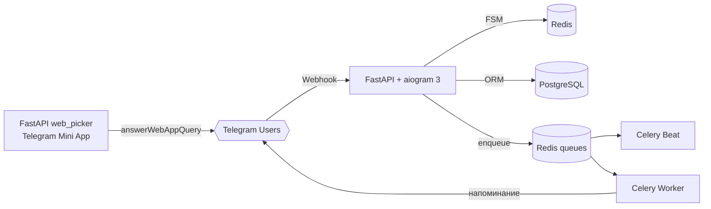

# TG Notes Bot


> Телеграм-бот для заметок и напоминаний с поддержкой Telegram Mini App, очередями Celery и асинхронным стеком на aiogram 3 + FastAPI.

## Содержание
- [О проекте](#о-проекте)
- [Ключевые возможности](#ключевые-возможности)
- [Архитектура](#архитектура)
- [Технологический стек](#технологический-стек)
- [Пользовательский сценарий](#пользовательский-сценарий)
- [Web Picker Mini App](#web-picker-mini-app)
- [Структура проекта](#структура-проекта)
- [Переменные окружения](#переменные-окружения)
- [Запуск через Docker](#запуск-через-docker)
- [Локальная разработка](#локальная-разработка)
- [Миграции и утилиты](#миграции-и-утилиты)
- [CI/CD](#cicd)
- [Дорожная карта](#дорожная-карта)
- [English TL;DR](#english-tldr)

## О проекте

TG Notes Bot — pet-проект, который демонстрирует продакшен-подход к созданию Telegram-сервисов: бот работает на вебхуках, сохраняет заметки и напоминания в PostgreSQL, хранит состояние в Redis и планирует отправку через Celery. Отдельный сервис web_picker реализует Telegram Mini App для выбора даты и времени.

### TL;DR
- Asynchronous-first стек: aiogram 3 + FastAPI + SQLAlchemy async + Redis.
- Надёжная доставка уведомлений за счёт Celery worker/beat и идемпотентных задач.
- Полностью контейнеризованный деплой и GitHub Actions пайплайн.

## Ключевые возможности
- Многошаговое создание заметки с FSM aiogram: заголовок, тело, дата напоминания.
- Инлайн-список заметок с пагинацией и быстрым переходом к редактированию/удалению.
- WebApp выбор времени (Timesnap) с проверкой `initData` и ответом через `answerWebAppQuery`.
- Редактирование заметок без /команд: обновление заголовка, текста, времени или полное удаление.
- Планирование и переотправка напоминаний через Celery с `eta` и защитой от гонок (`select … for update skip locked`).
- Разделение на сервисы: FastAPI-вебхук, Celery worker/beat, Flower мониторинг, web_picker микросервис.
- Безопасность: секрет для вебхука, HMAC-подпись Telegram Mini App, редактирование только после проверки пользователя.

## Архитектура



### Компоненты
- `bot/main.py` — FastAPI-приложение, поднимающее aiogram Dispatcher, настраивает вебхук и Redis-хранилище FSM.
- `bot/celery/*` — Celery-конфигурация, periodic tasks (`check_reminders`) и delivery (`send_reminder`) с автоматическими ретраями.
- `bot/models` — SQLAlchemy модели (`Note`, `Reminder`, `User`) с `selectin`-загрузкой.
- `bot/services` — бизнес-логика сохранения/получения заметок, работа с изображениями и валидацией ISO-времени.
- `web_picker` — FastAPI-сервис для Mini App: эндпоинты `/picker` и `/tma/submit`, валидация подписи и обратный ответ в Telegram.
- `docker-compose*.yml` — запуск локально и в проде (отдельные образы, Flower, прогрев миграций).

## Технологический стек

| Слой | Технологии | Зачем |
|------|------------|-------|
| Бот | aiogram 3, FastAPI, uvicorn | Вебхуки, FSM, маршрутизация и асинхронные хэндлеры. |
| Данные | PostgreSQL, SQLAlchemy async, Alembic | Надёжное хранение заметок, миграции, транзакционность. |
| Очереди | Celery 5.5, Redis | Планирование и повторная доставка напоминаний, beat + worker. |
| Инфраструктура | Docker, docker-compose, GitHub Actions | Быстрый старт, CI/CD, выкладка образов. |
| Web Picker | FastAPI, httpx, Telegram Mini App | Сбор времени с клиента, проверка `initData`, обратная отправка. |
| Качество | Poetry, Ruff | Управление зависимостями, статический анализ. |

## Пользовательский сценарий

1. Пользователь вводит `/start` и получает клавиатуру с основными действиями.
2. `/new` (или кнопка) запускает FSM: бот спрашивает заголовок, тело (опционально) и предлагает WebApp-выбор времени.
3. Web Picker возвращает ISO-время, бот сохраняет заметку и планирует напоминание через Celery, отправляя визуальное подтверждение с изображением.
4. Команда просмотра выводит список заметок с пагинацией. Каждая заметка открывается отдельной карточкой с inline-кнопками.
5. Из карточки можно изменить заголовок/текст/дату или удалить заметку; состояние и очереди обновляются транзакционно.

## Web Picker Mini App
- Развёрнут как отдельный FastAPI-сервис (`web_picker/main.py`) и отдаёт статику `/picker`.
- Принимает `x-telegram-init-data`, проверяет подпись через HMAC (`validators.validate_init_data`), что предотвращает подмену данных.
- Возвращает время с учётом смещения часового пояса пользователя и отвечает в Telegram через `answerWebAppQuery`.
- Может быть размещён на любом домене, ссылка задаётся переменной `BASE_WEBAPP_URL`.

## Структура проекта

```text
tg-notes-bot/
├── bot/
│   ├── main.py                 # FastAPI + aiogram, регистрация вебхука
│   ├── celery/                 # Celery конфигурация, события жизненного цикла
│   ├── handlers/               # FSM-хэндлеры бота (создание, список, редактирование)
│   ├── keyboards/              # Инлайн/текстовые клавиатуры и callback-датаклассы
│   ├── middlewares/            # Подключение Session в хэндлеры
│   ├── repositories/           # Базовый CRUD и специфичные репозитории
│   └── services/               # Бизнес-логика заметок и вспомогательные утилиты
├── web_picker/                 # Telegram Mini App backend
├── migrations/                 # Alembic миграции
├── docker-compose.yml          # Локальный запуск (bot, celery, redis, postgres, web_picker)
├── docker-compose.prod.yml     # Прод с готовыми образами, Flower мониторингом
├── pyproject.toml              # Зависимости и конфигурация Poetry
└── .github/workflows/          # CI/CD сценарий выкладки
```

## Переменные окружения

| Переменная | Описание | Пример |
|------------|----------|--------|
| `BOT_TOKEN` | Токен Telegram-бота | `123456789:ABC...` |
| `BASE_WEBAPP_URL` | Базовый URL веб-приложения (домен для вебхука и Mini App) | `https://example.com` |
| `WEBHOOK_SECRET` | Секрет для заголовка `X-Telegram-Bot-Api-Secret-Token` | `super-secret` |
| `POSTGRES_*` | Настройки подключения к PostgreSQL | `notes`, `notes_user`, `5432`, `postgres` |
| `REDIS_*` | Настройки Redis (FSM, Celery broker/backend) | `redis`, `6379`, `notes_pass` |
| `CELERY_BROKER_URL`* | URL брокера для Flower | `redis://:pass@redis:6379/1` |
| `CELERY_RESULT_BACKEND`* | Backend результатов для Flower | `redis://:pass@redis:6379/2` |
| `FLOWER_PORT`*, `FLOWER_BASIC_AUTH`* | Настройки Flower мониторинга | `5555`, `user:password` |

\* — используются только в продакшен-compose.

## Запуск через Docker

1. Скопируйте `.env.example` в `.env` и заполните обязательные переменные (`BOT_TOKEN`, `BASE_WEBAPP_URL`, `WEBHOOK_SECRET`, пароли).
2. Поднимите инфраструктуру:
   ```bash
   docker compose up --build
   ```
3. После инициализации миграций бот будет доступен на `http://localhost:8080`, web_picker — на `http://localhost:8000/picker`. Проверьте лог Celery — напоминания планируются автоматически.

## Локальная разработка

```bash
poetry install
# Переменные читаются из .env
poetry run alembic upgrade head              # применить миграции
poetry run uvicorn bot.main:app --reload     # запустить webhook-приложение (локально + ngrok для Telegram)
poetry run celery -A bot.celery.main.app beat -l INFO
poetry run celery -A bot.celery.main.app worker -l INFO -Q reminders,maintenance --concurrency=4
poetry run uvicorn web_picker.main:app --reload
```

> Для локального теста вебхуков используйте `ngrok`/`localtunnel` и пропишите публичный URL в `BASE_WEBAPP_URL`.

## Миграции и утилиты
- Создать миграцию: `poetry run alembic revision --autogenerate -m "message"`.
- Статический анализ: `poetry run ruff check bot web_picker`.
- Форматирование и автофикс: `poetry run ruff check --fix`.
- (Опционально) Тесты — каркас под `pytest` легко расширяется (план в road map).

## CI/CD
- GitHub Actions (`.github/workflows/production_deployment.yml`) собирает два Docker-образа (`bot`, `web_picker`) и пушит их в Docker Hub.
- После сборки пайплайн копирует `docker-compose.prod.yml` и выкатывает проект на удалённый сервер по SSH.
- Завершает деплой уведомление в Telegram через `appleboy/telegram-action`.

## Дорожная карта
- Добавить интеграционные тесты бота (pytest + aiogram тест-клиент).
- Расширить WebApp: выбор шаблонов времени, встроенный календарь.
- Ввести наблюдаемость (Prometheus/Grafana или Loki).
- Поддержать совместные пространства для команд (шаринг заметок).

## English TL;DR

TG Notes Bot is a production-style Telegram reminder bot built with aiogram 3, FastAPI, PostgreSQL, Redis, and Celery. It stores notes, schedules reminders through Celery workers, and ships with a standalone FastAPI service for a Telegram Mini App time picker. The project is fully dockerized and ready for continuous deployment via GitHub Actions.
